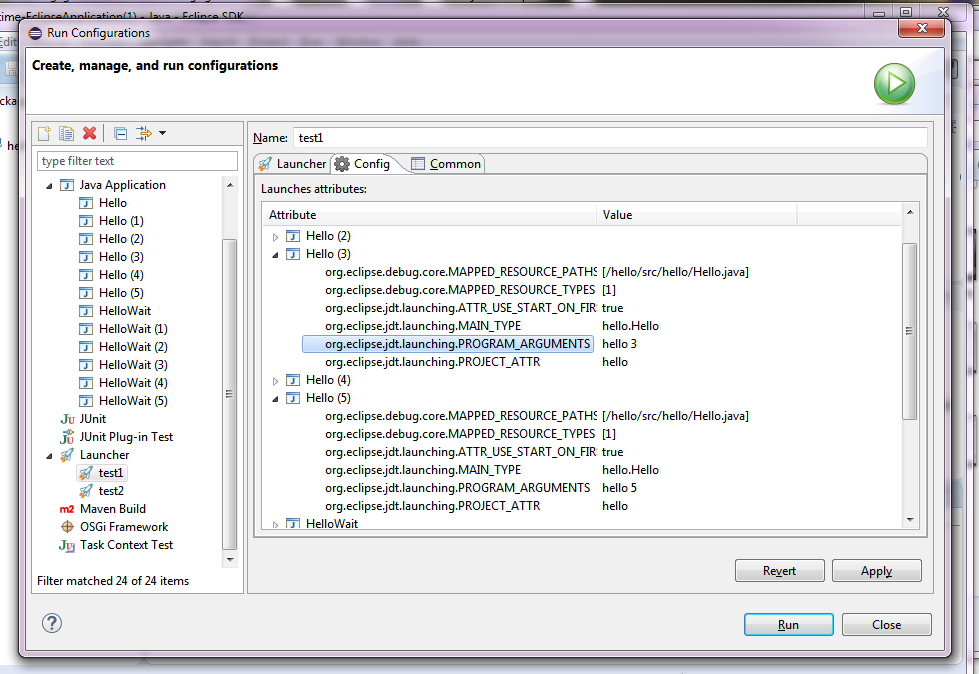

# Eclipse Launcher

Eclipse Launcher Plug-ins for composite launches.

### This plug-in provides:
* Adding iterations;
* Adding delays;
* Adding launches;
* Selecting mode of launches;
* Drag'n'drop launches in launcher's widget;
* Showing attributes of launches.

Launches in one iteration will be wait terminating previous launches.

### Screenshots

